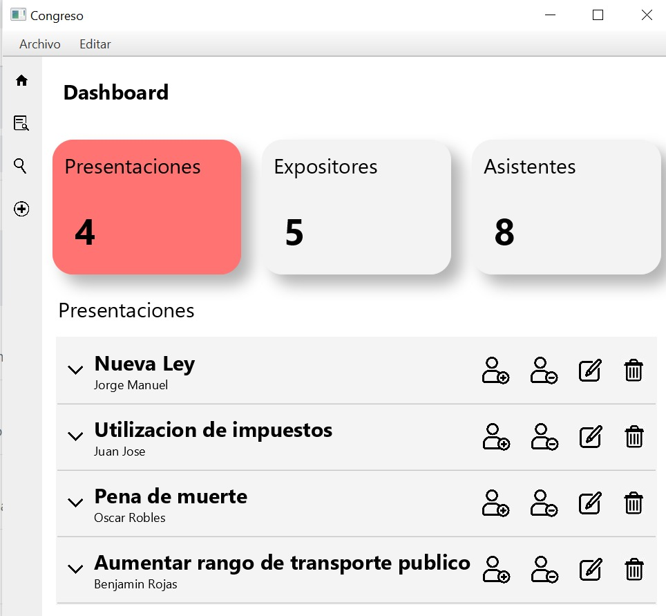
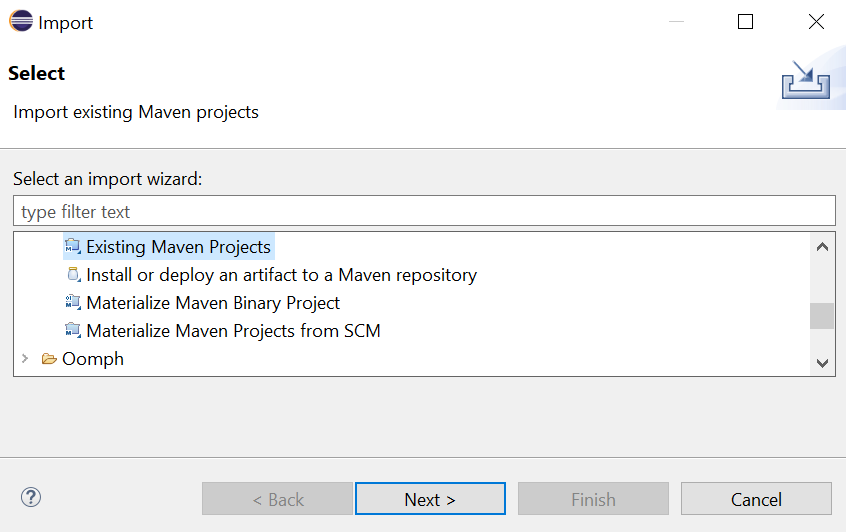
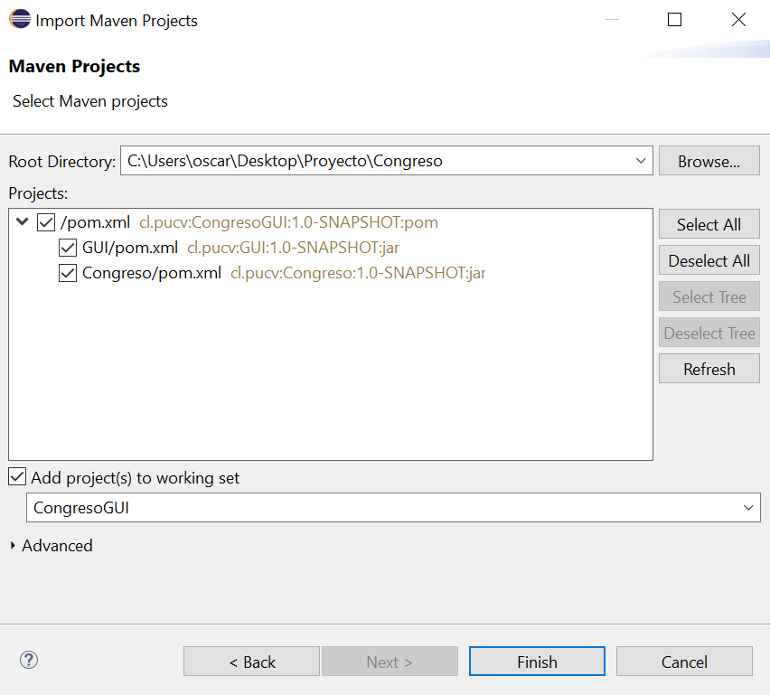
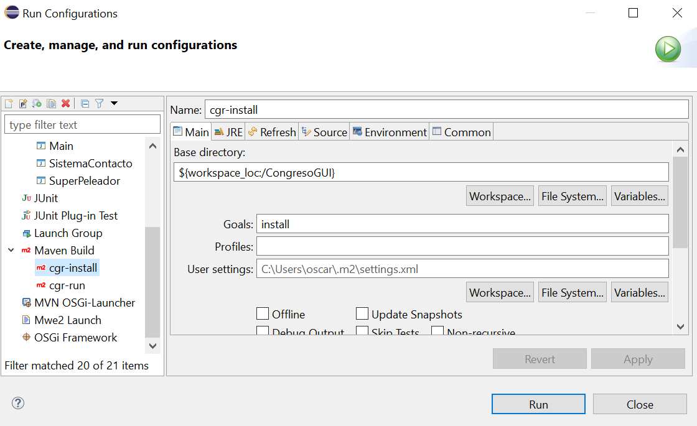
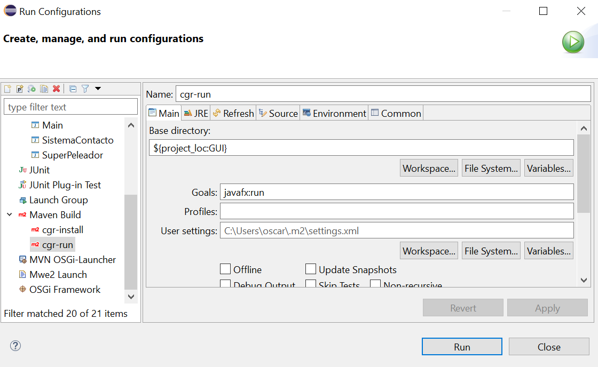

# Congreso

Congreso(GUI) es una herramienta de administración de presentaciones en un congreso internacional.



## Instalación

Para facilitar el proceso de instalación se provee un ZIP en la pestaña releases del repositorio Github. Este incluye todo lo necesario para ejecutar el proyecto sin necesidad de compilarlo, ni JavaFX, ni eclipse, ni instalar maven.

[Enlace de descarga](https://github.com/cykrr/Congreso/releases/tag/v1)

Para ejecutarlo es necesario extraer el archivo y ejecutar el archivo GUI.bat que se encuentra en la carpeta bin. (Es necesario ejecutarlo desde el directorio bin, de lo contrario no encontrará el directorio ``../data``.


## Contribuir

### Eclipse

1.- Clonar el repositorio

```git clone https://github.com/cykrr/Congreso CongresoGUI```

2.- Importar el proyecto en eclipse

Si ya tenías un proyecto con el mismo nombre es  necesario eliminarlo.

2.1.- Selecciona Maven -> Proyecto Maven existente.


2.2.- Selecciona la carpeta donde se clonó el repositorio


2.3.- Ejecuta el runner facilitado. Primero es necesario instalar la dependencia Congreso.



2.4.- Posteriormente se ejecuta el programa con el siguiente runner: 




